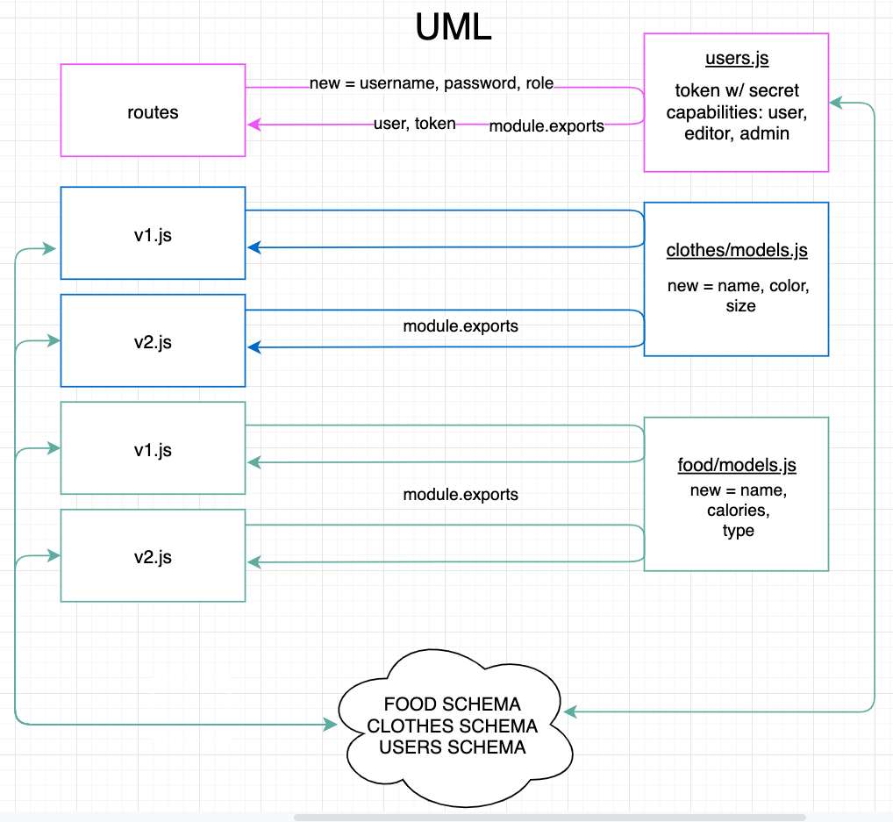

# LAB - Class 08

## Project: AUTH API

### Author: Mariko Alvarado

### Links and Resources
-  Simon, Ricardo, Stacy

- [heroku](http://mariko-auth-api.herokuapp.com/)
- [githubActions]()
- [PR]()

### Setup

#### `.env` requirements (where applicable)

- `PORT` - 3000
- `MONGODB_URI` - mongodb://localhost:27017/autha

#### How to initialize/run your application (where applicable)

Plug in front end url localhost:3000/signup or /signin into postman and perform different requests.

#### Tests

1. install `@code-fellows/supergoose`
2. run `npm test` 

#### UML

